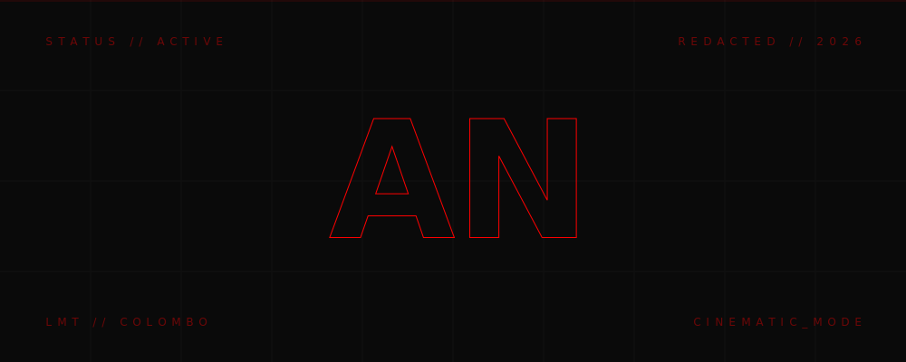

  
  
   
  
  

    <samp>
      <b>[ REDACTED // 2026 ]</b> &nbsp;&nbsp; <b>[ ENTRY // SESSION 02 ]</b> &nbsp;&nbsp; <b>[ STATUS // LIVE_STATION ]</b>
    </samp>
  

  <h1 align="center">
    
  </h1>
  
  

    <b>CREATIVE DEVELOPER | 3D WEB SPECIALIST | UI/UX INNOVATOR</b>
  

---

### ⚡ // THE_VISION

I am a **Creative Developer** obsessed with the intersection of high-end aesthetics and technical precision. I don't just build websites; I engineer immersive digital experiences that demand attention. Based in **Colombo**, I specialize in crafting products that leave a lasting **"WOW"** factor.

---

### 📂 // DATABASE // SELECTED_WORK

| ENTRY | CATEGORY | TECHNOLOGY | STATUS |
| :--- | :--- | :--- | :--- |
| **[Edu Gate Consultancy](https://www.edugateconsultancy.com/)** | WEB / EDUCATION | Next.js, TS, GSAP | `[ LIVE ]` |
| **[Gimhani Tours](https://gimhani-tours.com/)** | WEB / TOURISM | Next.js, Tailwind | `[ LIVE ]` |
| **[Lumina Frame](https://photographic-website-blond.vercel.app/)** | WEB / PHOTOGRAPHY | 3D Parallax, GSAP | `[ LIVE ]` |
| **[Dental AI Pro](https://aknilupul-DentalAI-Platform.hf.space/)** | AI / HEALTHCARE | FastAPI, TensorFlow | `[ LIVE ]` |
| **[Aura Academic Agent](https://aknilupul-aura-acadamic-agent.hf.space/)** | AI / CHATBOT | Python, NLP | `[ LIVE ]` |

---

### 🛠️ // CORE_STACK // ARCHITECTURE

  

---

### 📊 // ANALYTICS // PERFORMANCE_METRICS

  
  

  

---

### 🔗 // CONNECT // PROTOCOL

  
  
  
  
  

---

  

    <samp>
      <b>LMT // COLOMBO</b> &nbsp;&nbsp; <b>REDACTED // 2026</b>
    </samp>
  

  

