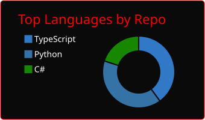
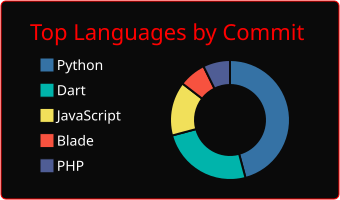
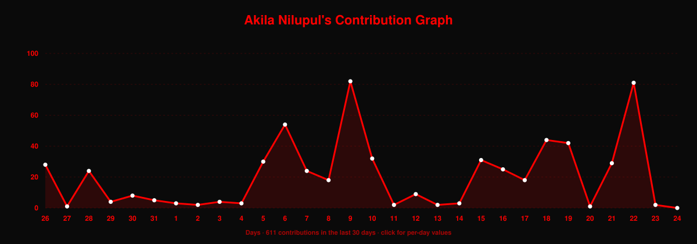

  

 

  

 

  

 

  <samp>
    <b>[ GALLE, SRI LANKA ]</b> &nbsp;&nbsp;&bull;&nbsp;&nbsp;
    <b>[ BEng (HONS) SOFTWARE ENGINEERING ]</b> &nbsp;&nbsp;&bull;&nbsp;&nbsp;
    <b>[ LONDON METROPOLITAN UNIVERSITY ]</b>
  </samp>

---

### ⚡ // THE_VISION

I'm a **Software Engineer (AI & Full-Stack)** at **Zonova Tech**, and a **Technical Expert** on the **SISEPUEDE** integrated assessment programme at **UNEP-CCC** — the UN Environment Programme's Copenhagen Climate Centre — supporting Sri Lanka's Article 6 climate modelling. **BEng (Hons) Software Engineering**, London Metropolitan University. Based in **Galle, Sri Lanka**.

I ship end to end: storefront to vendor dashboard to Android build to production security headers. In 2026, the marketplace I engineer — **zonova.lk** — took **two national awards** at BestWeb.lk, and my computer-vision research was **accepted for oral presentation** at EICON 2026 after peer review.

> *"I build systems that ship."*

 

| DETAIL | INFO |
|:---|:---|
| 💼 **Now** | Software Engineer (AI & Full-Stack) @ **Zonova Tech** · Technical Expert @ **UNEP-CCC** |
| 🎓 **Degree** | BEng (Hons) Software Engineering — London Metropolitan University · **2:1** |
| 🏆 **Awards** | 2× national winner, BestWeb.lk 2026 (LK Domain Registry) |
| 📄 **Research** | *AI-Powered Dental Prosthetic and Recommendation System* — accepted, EICON 2026 |
| 📍 **Location** | Galle, Sri Lanka — open to international & remote roles |
| 📧 **Email** | akilanilupul3@gmail.com |
| 🌐 **Portfolio** | [**akila-portfolio.vercel.app →**](https://akila-portfolio.vercel.app/) |

---

### 📊 // CAREER_STATS

  
  
  
  
  

---

### 🏆 // RECOGNITION // THE_RECORD

  
  

 

| AWARD | BODY | DECIDED BY | YEAR |
| :--- | :--- | :--- | :--- |
| **Best Micro Enterprise Website of the Year** | [BestWeb.lk, LK Domain Registry](https://bestweb.lk/past-winners/2/) | Judged category — awarded to `zonova.lk` | `2026` |
| **Most Popular Micro Enterprise Website of the Year** | [BestWeb.lk, LK Domain Registry](https://bestweb.lk/past-winners/2/) | Public vote — same site, same year | `2026` |
| **Certificate of Appreciation** | BestWeb.LK, LK Domain Registry | Issued to me by name, *"for development of the website zonova.lk"* | `2026` |
| **Presidential Award — Best Dancing Team of the Year** | Kandy Esala Perahera | Kandyan Ves team, presented by the President of Sri Lanka | `2025` |
| **Presidential Award — Best Emerging Dancing Team of the Year** | Kandy Esala Perahera | Kandyan Ves team, presented by the President of Sri Lanka | `2024` |

> Both national awards belong to **zonova.lk**, the site I built end to end — storefront, vendor dashboard and the services behind both. The certificate is the one made out to the developer rather than the company.

---

### 🔬 // RESEARCH // PEER_REVIEWED

**AI-Powered Dental Prosthetic and Recommendation System** · Paper `FPC10` · **Accepted — oral presentation**
*ESOFT International Conference 2026 (EICON 2026), ESOFT University, Kandy* · presented 30 Aug 2026

  
  
  
  
  

A fine-tuned **YOLOv8-Nano** detector reads ten classes of dental condition from panoramic radiographs; a hybrid rule-based scoring engine over a nine-treatment knowledge base ranks candidate prosthetic treatments by clinical, demographic and budget factors, and returns the top five with rationales, indicative costs and a downloadable clinical-handover report.

Commercial dental AI reads radiographs and marks pathology — it doesn't say what to do about it for *this* patient. The contribution is the integration: every ranked recommendation traces back to the finding that triggered it. Sole author-developer; both co-authors supervised the project. The headline figure above is the **held-out test split**, not the validation split the manuscript reports — and the [case study](https://akila-portfolio.vercel.app/work/dental-ai-pro) publishes the per-class table where that average hides the truth.

---

### 🌐 // MY_PORTFOLIO

  
  

> Built with **Next.js 15 · React 19 · TypeScript · Tailwind CSS · Framer Motion · Lenis** — a cinematic loader, scroll-scrubbed sequences, a magnetic cursor, a command palette, generated OG images, a JSON Resume endpoint and a build-time CV pipeline. Thirteen projects, written up as case studies with the decisions and the trade-offs, not just the screenshots.

---

### 🛠️ // THE_STACK

**Languages**

**Frontend**

**Backend & Data**

**AI, ML & Analysis**

**Cloud, Mobile & DevOps**

**Testing, Security & Craft**

**Design & Tools**

![Adobe XD](https://img.shields.io/badge/Adobe_XD-0A0A0A?style=flat-square&logo=%2BPC9zdmc%2B)

---

### 📂 // DATABASE // SELECTED_WORK

| ENTRY | PROJECT | CATEGORY | TECH | STATUS |
| :--- | :--- | :--- | :--- | :--- |
| `01` | **[Zonova](https://zonova.lk)** — 🏆 2× national award winner | WEB / AI COMMERCE | React 19 · TS · Firebase · Gemini · Capacitor | `[ LIVE ]` |
| `02` | **[Zonova Group](https://main.zonova.lk)** | WEB / CORPORATE | Astro · Cloudflare Workers · GSAP · Lenis | `[ LIVE ]` |
| `03` | **[Zonova Tech](https://tech.zonova.lk)** | WEB / AGENCY | Astro · Cloudflare Workers · R2 · RSS | `[ LIVE ]` |
| `04` | **[Zonova Lens](https://lens.zonova.lk)** | WEB / PHOTOGRAPHY | Astro · Sharp · Node.js · HEIC pipeline | `[ LIVE ]` |
| `05` | **[Edu Gate Consultancy](https://www.edugateconsultancy.com/)** | WEB / EDUCATION | Next.js · TS · Tailwind · Framer Motion | `[ LIVE ]` |
| `06` | **[Gimhani Tours](https://gimhani-tours.com/)** | WEB / TOURISM | Next.js 14 · TS · Static export · SEO | `[ LIVE ]` |
| `07` | **[Lumina Frame](https://photographic-website-blond.vercel.app/)** | WEB / PHOTOGRAPHY | Next.js · GSAP · Framer Motion · TS | `[ LIVE ]` |
| `08` | **[Aura Academic Agent](https://aknilupul-aura-acadamic-agent.hf.space/)** | AI / CONVERSATIONAL | Python · FastAPI · Gemini · ChromaDB | `[ LIVE ]` |
| `09` | **[Dental AI Pro](https://aknilupul-dentalai-platform.hf.space/)** — 📄 EICON 2026 | AI / HEALTHCARE | FastAPI · YOLOv8 · OpenCV · MongoDB | `[ LIVE ]` |
| `10` | **[Diamond Shine](https://github.com/akila-ncmd/Hotel-System)** | WEB / HOSPITALITY SYSTEMS | Laravel 10 · PHP 8.1 · MySQL · PHPUnit | `[ ARCHIVED ]` |
| `11` | **[EatBest](https://restaurant-website-nu-nine.vercel.app)** · [`src`](https://github.com/akila-ncmd/Restaurant-Website) | WEB / RESTAURANT | Next.js 16 · React 19 · R3F · Tailwind v4 | `[ LIVE ]` |
| `12` | **[EVC](https://evc-mobile-app.vercel.app)** · [`src`](https://github.com/akila-ncmd/EVC-Mobile-App) | MOBILE / STREAMING | Flutter · Dart · Riverpod · Adobe XD | `[ LIVE ]` |
| `13` | **[Avengers: Doomsday](https://iron-man-website-flame.vercel.app)** · [`src`](https://github.com/akila-ncmd/Iron-Man-Website) | DESIGN / CONCEPT SITE | Next.js 16 · R3F · Framer Motion · Lenis | `[ LIVE ]` |

> Every one of these is written up as a case study on the [portfolio](https://akila-portfolio.vercel.app/work) — the context, the constraints, the decisions **and the options I rejected**.

---

### 🧭 // HOW_I_WORK

- I'd rather ask one clarifying question early than rebuild a week later.
- I write the trade-off down. If I chose something, I can tell you what I rejected and why.
- I read the existing code before adding to it, and match its idiom rather than importing my own.
- I flag the thing I broke before someone else finds it.

---

### 📊 // ANALYTICS // PERFORMANCE_METRICS

  
  

  

 

  

---

### 🔗 // CONNECT // PROTOCOL

  
  
  
  
  
  
  

---

  <samp><b>GALLE, SRI LANKA</b> &nbsp;&nbsp;&bull;&nbsp;&nbsp; <b>SOFTWARE ENGINEER // AI &amp; FULL-STACK</b> &nbsp;&nbsp;&bull;&nbsp;&nbsp; <b>OPEN TO INTERNATIONAL ROLES</b></samp>
    
  

